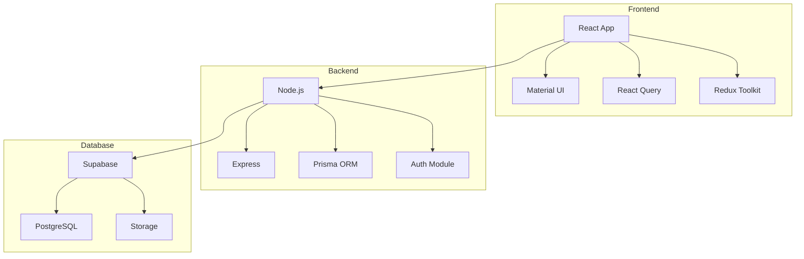
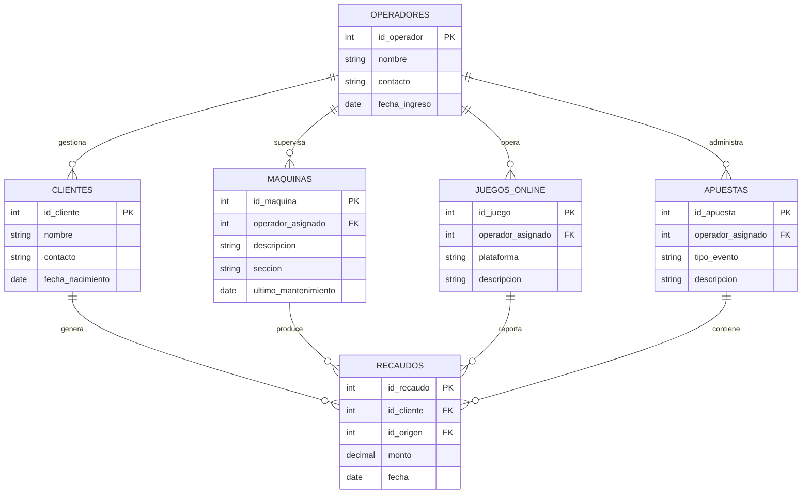
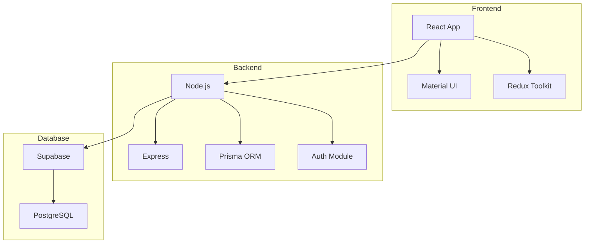
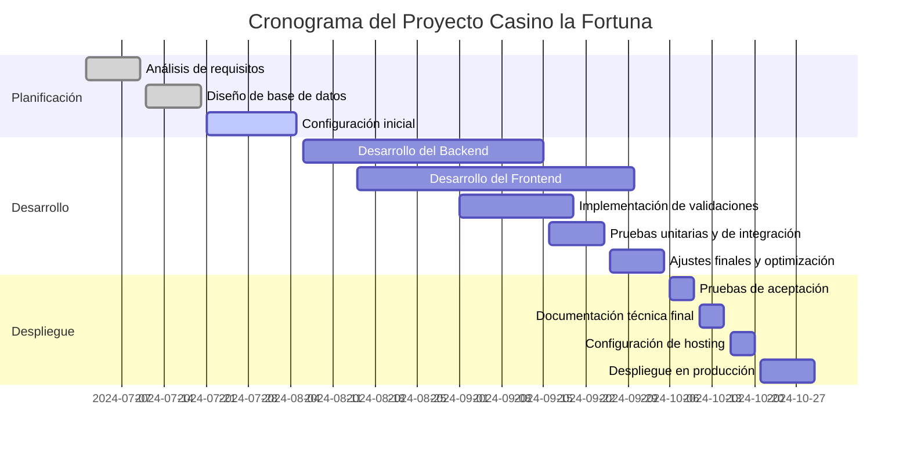

<div align="center">

# Documentación del proceso de implantación de software siguiendo estándares de calidad


## Presentado por:
**Penélope Noreña Ramos**
**Hernán Darío Pérez Higuita**
**William Pérez Muñoz**

### Instructor:
**Ing. Jhon Jairo Donato**

## Servicio Nacional de Aprendizaje - SENA
### Centro de Gestión de Mercados, Logística y Tecnologías de la Información
### Regional Distrito Capital

#### Tecnología en Análisis y Desarrollo de Software
#### Ficha: 2758315.
### 2024

</div>

---

# Prefacio

<div align="justify">

## Introducción

Este documento ha sido diseñado con base en el formato propuesto, adaptándolo a las necesidades específicas de nuestro proyecto, *Casino la Fortuna*. Este software, actualmente en fase de desarrollo, representa nuestra visión de un sistema integral para la gestión y administración de operaciones de casino.

Aunque algunas secciones del documento incluyen elementos proyectados o teóricos, reflejan nuestro compromiso por adoptar buenas prácticas en el diseño, desarrollo e implementación de software. Este trabajo no solo busca documentar el proceso de implantación, sino también servir como guía técnica y estratégica que facilite la culminación exitosa del proyecto.

---

### Video Promocional del Software

A continuación, presentamos un video que destaca las principales características y beneficios del software Casino la Fortuna:

<a href="https://youtu.be/jXgIpYTIzCo" target="_blank">
  
</a>

_Haga clic en la imagen para ver el video en YouTube._

---

## Objetivo del Documento

El objetivo principal de este documento es estructurar los lineamientos necesarios para garantizar una implantación eficiente del software, siguiendo estándares de calidad reconocidos. Se proyecta como una herramienta que permita:

1. **Documentación Integral:**
   - Procesos clave de desarrollo
   - Procedimientos de mantenimiento
   - Protocolos de soporte técnico

2. **Aseguramiento de Calidad:**
   - Establecimiento de estándares de calidad
   - Métricas de rendimiento
   - Procesos de verificación y validación

3. **Gestión Estratégica:**
   - Marco para toma de decisiones
   - Planificación de recursos
   - Gestión de riesgos

4. **Evolución del Sistema:**
   - Base técnica para futuras iteraciones
   - Guía para mejoras continuas
   - Adaptabilidad a nuevos requerimientos

---

## Alcance del Documento

Este documento abarca:

- Procesos de implantación y migración
- Planes de mantenimiento y soporte
- Manuales técnicos y de usuario
- Procedimientos de respaldo y recuperación
- Documentación de arquitectura y configuraciones

Con esta documentación buscamos no solo cumplir con las expectativas actuales, sino también preparar el camino hacia un sistema robusto, confiable y alineado con las mejores prácticas del sector.

---

<br>
<br>
<br>

## Equipo de Trabajo

### Integrantes del Proyecto

#### William Pérez Muñoz
- **Rol:** Coordinador del Proyecto, Backend Developer
- **Responsabilidades:**
  - Configuración del servidor (Node.js, Supabase)
  - Gestión de API REST
  - Aseguramiento de la integración con Supabase
  - Coordinación del equipo de desarrollo

#### Hernán Darío Pérez Higuita
- **Rol:** Frontend Developer
- **Responsabilidades:**
  - Implementación de interfaces responsivas (React, Bootstrap)
  - Gestión del estado global
  - Validaciones del cliente
  - Desarrollo de componentes reutilizables

#### Penélope Noreña Ramos
- **Rol:** QA y DevOps
- **Responsabilidades:**
  - Configuración de pipeline CI/CD
  - Pruebas de carga, funcionalidad y rendimiento (JMeter)
  - Configuración de backups automáticos
  - Monitoreo y optimización del sistema

## Diseño del plan de mantenimiento y soporte del software

### Tipos de Mantenimiento

#### Mantenimiento Preventivo

El mantenimiento preventivo busca garantizar que el sistema *Casino la Fortuna* opere de manera óptima, minimizando la probabilidad de fallos mediante acciones planificadas.

##### Actividades principales:

1. **Monitoreo del sistema:** 
   - Configuración de alertas automáticas en *Render Logs* para detectar comportamientos anómalos
   - Análisis semanal de métricas del backend y frontend para identificar cuellos de botella
   - Revisión constante de métricas y logs para identificar patrones anómalos
   - Monitoreo en tiempo real del rendimiento del sistema usando *Supabase Insights*
   - Detección temprana de posibles problemas mediante alertas configuradas

2. **Actualización de componentes:** 
   - Actualización mensual de dependencias críticas mediante `npm audit`
   - Pruebas de compatibilidad en un entorno de staging utilizando Postman
   - Actualización sistemática de dependencias del backend Node.js y frontend React
   - Verificación de compatibilidad entre componentes y Bootstrap
   - Documentación de cambios significativos en Notion o Google Docs

3. **Optimización de la base de datos:** 
   - Verificación trimestral de índices y consultas en Supabase
   - Depuración de datos de pruebas o redundantes
   - Revisión del tamaño de tablas y particiones para mejorar tiempos de respuesta
   - Mantenimiento de consultas optimizadas
   - Monitoreo del rendimiento de las consultas

4. **Pruebas de rendimiento:** 
   - Ejecución trimestral de pruebas de carga con JMeter para simular diferentes niveles de uso
   - Validación de tiempos de respuesta inferiores a 2 segundos bajo alta demanda
   - Simulación de usuarios simultáneos
   - Monitoreo de rendimiento durante horarios pico para garantizar estabilidad
   - Identificación y resolución de cuellos de botella

5. **Respaldos regulares:** 
   - Configuración de backups automáticos diarios en Supabase
   - Verificación semanal de integridad de los respaldos almacenados en Google Drive
   - Respaldo de archivos críticos
   - Retención de copias por 30 días con políticas claras de restauración
   - Pruebas periódicas de restauración para validar integridad

#### Mantenimiento Correctivo

El mantenimiento correctivo se centra en resolver errores detectados en el sistema *Casino la Fortuna*, asegurando la continuidad operativa y previniendo problemas recurrentes.

##### Actividades principales:

1. **Corrección de bugs:** 
   - Reparación de errores detectados en el backend desarrollado en Node.js
   - Solución de problemas de visualización en componentes React del frontend
   - Verificación de correcciones implementadas mediante pruebas automatizadas en Cypress
   - Documentación detallada de soluciones aplicadas
   - Seguimiento post-implementación de correcciones

2. **Compatibilidad:** 
   - Pruebas periódicas en navegadores como Chrome, Edge y Firefox
   - Resolución de incompatibilidades entre diferentes versiones de librerías utilizadas
   - Ajustes para garantizar el rendimiento en dispositivos móviles y de escritorio
   - Adaptación a diferentes dispositivos y resoluciones
   - Validación de componentes Bootstrap en diferentes plataformas

3. **Reparación de datos:** 
   - Identificación y resolución de inconsistencias en registros almacenados en Supabase
   - Restauración desde copias de seguridad verificadas
   - Implementación de validaciones adicionales para prevenir errores futuros
   - Recuperación de integridad en los datos
   - Validación de información restaurada

4. **Parches críticos:** 
   - Aplicación inmediata de actualizaciones de seguridad sugeridas por dependencias o frameworks
   - Evaluación de vulnerabilidades emergentes mediante herramientas como OWASP ZAP
   - Mitigación de vulnerabilidades emergentes
   - Documentación detallada de las acciones tomadas
   - Seguimiento post-implementación de parches

### Alcance del plan

| **Ítem** | **Descripción** |
|----------|----------------|
| Nombre del software | Casino la Fortuna |
| Componentes incluidos | - Backend (Node.js, Render)<br>- Frontend (React, Bootstrap, Vercel)<br>- Base de datos (Supabase) |
| Usuarios objetivo | - Personal administrativo (gerentes)<br>- Operadores del casino (crupieres)<br>- Clientes registrados |

<br>

### Actividades de Mantenimiento

| **Tipo** | **Actividad** | **Descripción** | **Acciones a realizar** | **Herramientas/Recurso** |
|----------|--------------|-----------------|------------------------|------------------------|
| Preventivo | Monitoreo del sistema | Revisión de logs y métricas | - Configurar alertas automáticas<br>- Monitoreo continuo<br>- Análisis de tendencias | - Render Logs<br>- Supabase Insights<br>- Grafana |
| Preventivo | Respaldo de datos | Copias de seguridad regulares | - Programar backups automáticos<br>- Revisiones manuales<br>- Validación de integridad | - Supabase Backup<br>- Google Drive |
| Preventivo | Actualización de software | Gestión de dependencias y frameworks | - Usar npm audit<br>- Verificar compatibilidad<br>- Documentar cambios | - npm<br>- CI/CD Pipeline en GitHub |
| Preventivo | Pruebas de rendimiento | Validación de carga del sistema | - Simular alta demanda<br>- Medir respuesta<br>- Optimizar recursos | - Apache JMeter<br>- Cypress |
| Correctivo | Gestión de incidencias | Manejo de problemas reportados | - Crear tickets<br>- Priorizar issues<br>- Seguimiento | - GitHub Issues<br>- Notion |
| Correctivo | Resolución de errores | Diagnóstico y corrección | - Debug de código<br>- Implementar soluciones<br>- Documentar procesos | - Chrome DevTools<br>- Visual Studio Code |
| Correctivo | Reparación de datos | Restauración de información | - Ejecutar scripts<br>- Validar datos<br>- Verificar integridad | - Supabase SQL Editor<br>- Postman |
| Correctivo | Documentación | Registro de problemas y soluciones | - Crear documentación<br>- Actualizar base de conocimiento<br>- Compartir aprendizajes | - Notion<br>- Google Docs |

<br>

### Cronograma de Mantenimiento

| **Actividad** | **Frecuencia** | **Responsable** | **Comentarios** |
|--------------|----------------|-----------------|----------------|
| Monitoreo del sistema | Diario | Equipo de DevOps | Uso de Grafana para visualizar métricas en tiempo real. Configuración de alertas para recursos críticos (CPU, memoria, respuesta del servidor) |
| Respaldo de datos | Diario/Semanal | Administrador de Base de Datos (DBA) | Copias incrementales diarias y completas semanales en Supabase. Almacenamiento en Google Drive con retención de 30 días |
| Actualización de software | Mensual | Equipo de Desarrollo | Actualización de dependencias con npm audit. Pruebas en staging usando Postman (API) y Cypress |
| Pruebas de rendimiento | Trimestral | Equipo de QA | Simulación con 500-1,000 usuarios concurrentes. Validación de tiempos de respuesta < 2 segundos bajo carga |
| Gestión de incidencias | Según demanda | Equipo de Soporte Técnico | Prioridades: Alta (< 1h), Media (< 4h), Baja (< 24h). Seguimiento en GitHub Issues |
| Resolución de errores | Según prioridad | Equipo de Desarrollo | Análisis colaborativo usando GitHub. Documentación detallada en Notion |
| Documentación de problemas | Post-resolución | Todo el equipo | Actualización en 24h máximo. Mantenimiento de wiki técnica en Notion |

<br>

### Indicadores de Desempeño (KPIs)

| **Indicador** | **Descripción** | **Objetivo** |
|--------------|-----------------|--------------|
| Tiempo promedio de resolución de incidencias (TPRI) | Tiempo promedio para corregir errores reportados | < 4 horas para incidencias críticas<br>< 24 horas para incidencias medias<br>< 72 horas para incidencias bajas |
| Disponibilidad del sistema | Porcentaje de tiempo que el software está operativo | > 99.9% de disponibilidad mensual<br>Máximo 43 minutos de downtime al mes |
| Número de errores recurrentes | Reducción de problemas ya registrados | < 5% de incidencias son problemas recurrentes<br>Tendencia descendente mes a mes |
| Tasa de respaldo exitoso | Porcentaje de copias de seguridad sin fallos | > 99.99% de backups exitosos<br>Verificación diaria de integridad |

<br>
<br>
<br>
<br>
<br>
<br>
<br>
<br>
<br>
<br>

### Revisión y Mejora

| **Ítem** | **Descripción** | **Objetivo** |
|----------|----------------|--------------|
| Revisión periódica | Evaluación completa del plan de mantenimiento | - Revisión mensual de métricas y KPIs<br>- Análisis trimestral de tendencias<br>- Auditoría semestral de procesos |
| Actualización del plan | Ajustes y optimizaciones del plan según hallazgos | - Actualizaciones trimestrales de procedimientos<br>- Incorporación mensual de mejores prácticas<br>- Refinamiento continuo basado en feedback |

---

<br>
<br>
<br>
<br>
<br>
<br>
<br>
<br>
<br>
<br>
<br>
<br>
<br>
<br>
<br>


# Documentación de plan de migración y respaldo de los datos del software

## 1. Proceso de Migración de Datos

### Definición de Migración

La migración de datos implica transferir información desde un sistema de origen a un nuevo sistema de destino, asegurando coherencia, exactitud y funcionalidad en el entorno implementado. En el proyecto *Casino la Fortuna*, este proceso garantiza la continuidad operativa y la integridad de datos como usuarios, transacciones y registros históricos.

### Fases del Proceso de Migración

#### Planificación:

- **Análisis del entorno:** 
  - Sistema de origen: **Base de datos PostgreSQL** actualmente operativa
  - Sistema de destino: **Supabase** con infraestructura en la nube
  - Evaluación de requisitos técnicos:
    - Espacio necesario para la base de datos
    - Herramientas de migración compatibles
    - Tiempo estimado de inactividad: **4 horas**
    - Estimación de recursos y personal necesario

- **Clasificación de datos:**
  - **Datos críticos:**
    - Información de usuarios registrados
    - Historial de transacciones financieras
    - Configuración del sistema
    - Perfiles de acceso y roles
  - **Datos secundarios:**
    - Logs de auditoría y seguridad
    - Archivos temporales o registros históricos
    - Documentación del sistema
    - Respaldos anteriores

- **Definición de objetivos:**
  - Realizar una migración completa sin pérdida de información
  - Validación de integridad al **100%** de los datos migrados
  - Documentación detallada para replicar o auditar el proceso
  - Tiempo máximo de inactividad: 4 horas
  - Plan de rollback en caso necesario

- **Selección de herramientas:**
  - **Supabase CLI:** Para exportación e importación eficiente de datos
  - **Node.js con pg-migrate:** Scripts personalizados
  - **Apache NiFi:** Para procesos ETL complejos
  - **pgAdmin:** Herramienta para validación manual
  - **Postman:** Verificación de APIs conectadas a la base de datos

#### Preparación:

- **Mapeo de datos:**
  - Diseño de esquemas equivalentes entre tablas en PostgreSQL y Supabase
  - Definición de transformaciones de datos, como ajustes en tipos de datos
  - Validación de reglas de negocio existentes
  - Documentación de reglas de mapeo
  - Verificación de constraints y relaciones

- **Pruebas piloto:**
  - Migración de un subconjunto de datos críticos para validación
  - Pruebas de integridad referencial y rendimiento de consultas
  - Verificación de transformaciones
  - Registro de resultados y métricas
  - Medición de tiempos de ejecución

- **Limpieza de datos:**
  - Eliminación de registros duplicados o redundantes
  - Normalización de formatos (fechas, campos de texto)
  - Validación de integridad antes de la migración completa
  - Corrección de datos inconsistentes
  - Actualización de referencias obsoletas

#### Ejecución:

- **Extracción:**
  - Respaldo completo del sistema de origen antes de iniciar
  - Exportación por módulos: usuarios, transacciones y configuraciones
  - Verificación de completitud de datos
  - Registro de métricas de exportación
  - Validación de checksums

- **Transformación:**
  - Aplicación de transformaciones necesarias para cumplir con el esquema destino
  - Verificación de consistencia tras cada transformación
  - Conversión de formatos de datos
  - Actualización de referencias
  - Validación de transformaciones realizadas

- **Carga:**
  - Importación secuencial de datos usando **Supabase CLI**
  - Validación de índices y restricciones
  - Actualización de índices
  - Verificación de constraints
  - Registro de métricas de importación

- **Resolución de errores:**
  - Registro de problemas detectados durante la migración
  - Aplicación de correcciones inmediatas y ajustes en los scripts
  - Documentación de soluciones aplicadas
  - Registro de lecciones aprendidas
  - Plan de contingencia ejecutado si necesario

#### Validación:

- **Pruebas de integridad:**
  - Comparación de totales de registros entre origen y destino
  - Validación de relaciones entre tablas críticas (usuarios y transacciones)
  - Verificación de consistencia de datos
  - Pruebas de consultas críticas
  - Validación de sumas de control

- **Pruebas funcionales:**
  - Verificación del correcto funcionamiento de las APIs conectadas
  - Pruebas manuales en las interfaces del frontend
  - Validación de cálculos críticos
  - Pruebas de rendimiento
  - Verificación de reportes clave

<br>
<br>

#### Cierre:

- **Documentación:**
  - Registro detallado de cada etapa del proceso
  - Documentación de incidencias y correcciones aplicadas
  - Registro de configuraciones realizadas
  - Manual de procedimientos actualizado
  - Documentación de lecciones aprendidas

- **Monitoreo:**
  - Seguimiento post-migración durante las primeras 24 horas
  - Evaluación del rendimiento en entornos reales
  - Detección y corrección de anomalías
  - Medición de KPIs establecidos
  - Análisis comparativo con métricas anteriores

## 2. Proceso de Respaldo de Datos

El respaldo de datos asegura la disponibilidad y recuperación de la información del software Casino la Fortuna. Este proceso es fundamental para garantizar la continuidad del negocio y la integridad de los datos.

### Fases del Respaldo de Datos

#### Planificación:

- **Identificación de datos críticos:**
  - Información de usuarios y perfiles de acceso
  - Registros de transacciones financieras
  - Historial de operaciones de juego
  - Configuraciones del sistema
  - Logs de auditoría y seguridad
  - Documentación del sistema

- **Frecuencia:**
  - Respaldos incrementales: Cada 6 horas
  - Respaldos completos: Diarios (durante horario de menor actividad)
  - Respaldos semanales: Almacenamiento a largo plazo
  - Snapshots de base de datos: Cada 12 horas

- **Elección de medios de almacenamiento:**
  - Principal: Supabase Cloud Storage con replicación
  - Secundario: Google Cloud Storage para redundancia
  - Terciario: Servidor local encriptado para respaldos críticos
  - Archivado: Almacenamiento frío para datos históricos

#### Ejecución:

- **Automatización:**
  - Implementación de scripts de respaldo automático
  - Configuración de tareas programadas en Supabase
  - Sistema de rotación automática de respaldos
  - Notificaciones automáticas de estado
  - Monitoreo continuo del proceso

- **Cifrado y seguridad:**
  - Encriptación AES-256 para todos los respaldos
  - Autenticación de dos factores para acceso
  - Segregación de respaldos por nivel de sensibilidad
  - Políticas de retención según normativa
  - Control de acceso basado en roles

- **Pruebas de restauración:**
  - Verificación semanal de restauración completa
  - Pruebas mensuales de recuperación parcial
  - Simulacros de desastre trimestrales
  - Documentación de procedimientos de recuperación
  - Validación de integridad post-restauración

#### Validación:

- **Pruebas periódicas:**
  - Verificación diaria de integridad de respaldos
  - Comprobación de checksums
  - Validación de estructura de datos
  - Testing de consistencia de información
  - Pruebas de recuperación selectiva

- **Monitoreo continuo:**
  - Implementación de sistema de alertas en tiempo real
  - Monitoreo de espacio de almacenamiento
  - Seguimiento de tiempos de respaldo
  - Registro de eventos y errores
  - Análisis de tendencias y patrones

#### Actualización:

- **Revisión del plan:**
  - Evaluación mensual de efectividad
  - Ajuste de frecuencias según necesidades
  - Optimización de procesos de respaldo
  - Actualización de políticas de retención
  - Incorporación de mejores prácticas

- **Registro:**
  - Documentación detallada de cada respaldo
  - Registro de restauraciones realizadas
  - Historial de incidencias y soluciones
  - Mantenimiento de logs de auditoría
  - Seguimiento de métricas de rendimiento

  ---
<br>
<br>
<br>
<br>
<br>
<br>
<br>
<br>
<br>
<br>
<br>
<br>
<br>

# Manual de Instalación del Software Casino la Fortuna

## Introducción

### Breve descripción del software
- **Nombre:** Sistema de Gestión Casino la Fortuna
- **Descripción:** Plataforma web para la administración de operaciones del casino, incluyendo:
  - Gestión de usuarios y perfiles
  - Procesamiento de transacciones
  - Análisis y reportes
  - Panel de administración
- **Versión:** 2.0
- **Stack tecnológico:** 
  - PostgreSQL (Base de datos)
  - Express (Backend framework)
  - React (Frontend framework)
  - Node.js (Runtime environment)
  - Bootstrap (UI framework)

### Requisitos del sistema

#### Hardware
- **Procesador:** Intel Core i5/AMD Ryzen 5 o superior
- **Memoria RAM:** 
  - Mínimo: 8GB
  - Recomendado: 16GB
- **Espacio en disco:** 20GB para instalación completa
- **Conexión a Internet:** 
  - Velocidad mínima: 10 Mbps
  - Recomendada: 20 Mbps

#### Software
- **Sistema operativo:** Ubuntu 20.04 LTS o superior
- **Node.js:** v16.x o superior
- **npm:** v8.x o superior
- **PostgreSQL:** v14.x o superior
- **Git:** Última versión estable
- **Docker (opcional):** v20.x o superior
- **Navegadores soportados:**
  - Chrome (últimas 2 versiones)
  - Firefox (últimas 2 versiones)
  - Edge (últimas 2 versiones)

## Preparación

### Archivos necesarios
- **Repositorio frontend:** 
  ```bash
  git clone https://github.com/casino-fortuna/frontend.git
  ```
- **Repositorio backend:** 
  ```bash
  git clone https://github.com/casino-fortuna/backend.git
  ```
- **Scripts de configuración:** Ubicados en `/scripts` dentro de cada repositorio
- **Archivos de ambiente:** `.env.example` para configurar variables de entorno

### Verificación de permisos
- **Escritura:** 
  - Directorio de instalación debe permitir escritura
  - Permisos para crear y modificar archivos
- **Acceso sudo:** 
  - Requerido para instalar dependencias
  - Necesario para configuración de servicios
- **Red:** 
  - Puerto 3000 (frontend)
  - Puerto 10000 (backend)
  - Puerto 5432 (PostgreSQL)

### Configuración previa
- **Firewall:**
  - Habilitar puerto 3000 para frontend
  - Habilitar puerto 10000 para backend
  - Habilitar puerto 5432 para PostgreSQL
- **Variables de entorno:**
  - Copiar y configurar `.env.example`
  - Configurar credenciales de Supabase
  - Establecer claves API necesarias
- **Base de datos:**
  - Crear proyecto en Supabase
  - Configurar política de acceso
  - Preparar esquemas necesarios

## Instrucciones de Instalación

### Entorno local

#### Frontend
```bash
# Acceder al directorio
cd frontend

# Instalar dependencias
npm install

# Configurar variables de entorno
cp .env.example .env

# Iniciar en modo desarrollo
npm run dev
```

#### Backend
```bash
# Acceder al directorio
cd backend

# Instalar dependencias
npm install

# Configurar variables de entorno
cp .env.example .env

# Iniciar en modo desarrollo
npm run dev
```

### Entorno servidor

#### Usando Docker
```bash
# Iniciar todos los servicios
docker-compose up -d

# Verificar estado
docker-compose ps
```

#### Despliegue manual
```bash
# Frontend en Vercel
vercel deploy

# Backend en Render
render deploy
```

### Configuraciones iniciales
- **Migraciones de base de datos:**
  ```bash
  npm run migrate
  ```
- **Creación de usuario administrador:**
  ```bash
  npm run create-admin
  ```
- **Configuración de Supabase:**
  - Establecer conexión
  - Verificar permisos
  - Configurar políticas de acceso
- **Verificación de servicios externos:**
  - APIs de terceros
  - Servicios de autenticación
  - Sistemas de pago (si aplica)

## Pruebas Post-Instalación

### Verificación del acceso
- **Frontend:** https://casino-la-fortuna.vercel.app/
- **Backend:** https://casino-la-fortuna-backend.onrender.com
- **Panel admin:** https://casino-la-fortuna.vercel.app/admin-dashboard

### Revisión de logs
```bash
# Logs del frontend
npm run logs

# Logs del backend
npm run logs

# Logs en Docker
docker-compose logs
```

### Validación funcional
- **Pruebas de autenticación:**
  - Login de administrador
  - Registro de usuario
  - Recuperación de contraseña
- **Operaciones CRUD:**
  - Gestión de usuarios
  - Manejo de transacciones
  - Configuración del sistema
- **Verificaciones técnicas:**
  - Conexión a base de datos
  - Respuesta de APIs
  - Rendimiento del sistema

## Resolución de Problemas Comunes

### Error de puertos en uso
```bash
# Verificar puertos ocupados
lsof -i :3000
lsof -i :10000

# Finalizar procesos en conflicto
kill -9 PID
```

### Errores de dependencias
```bash
# Limpiar caché de npm
npm cache clean --force

# Reinstalar dependencias
rm -rf node_modules
npm install
```

### Problemas de conexión a la base de datos
- **Verificaciones:**
  - Credenciales en `.env`
  - IP en whitelist de Supabase
  - Estado del servicio PostgreSQL
- **Soluciones comunes:**
  - Reiniciar servicios
  - Verificar conexión a Internet
  - Comprobar logs de error

## Soporte Técnico

### Contactos
- **Email:** soporte@casinofortuna.com
- **Teléfono:** +57 315 272 8882
- **Discord:** [Enlace al canal de soporte](https://discord.com/channels/1170963670013063229/117096367054153320)
- **Horario de atención:** 
  - Lunes a Viernes
  - 8:00 - 18:00 COL

### Recursos
- **Documentación técnica:**
  - API: `/api/docs`
  - Wiki: `/wiki`
  - Repositorio: GitHub
- **Base de conocimiento:**
  - Notion
  - Guías de usuario
  - FAQs

---
<br>
<br>
<br>
<br>
<br>
<br>
<br>
<br>
<br>

# Manual Técnico

El **Manual Técnico** está dirigido a administradores y desarrolladores del sistema Casino la Fortuna, proporcionando información detallada sobre el funcionamiento interno del software y sus componentes técnicos.

## Estructura del Manual Técnico

### Introducción

#### Propósito del software
- Sistema integral de gestión para operaciones de casino
- Control de transacciones en tiempo real
- Gestión de usuarios y perfiles
- Monitoreo de actividades de juego
- Generación de reportes y análisis
- Módulos avanzados:
  - Sistema de contabilidad integrado
  - Estadísticas de ganancias y pérdidas
  - Análisis predictivo de comportamiento

#### Público objetivo
- Desarrolladores del sistema
- Administradores de plataforma
- Personal de soporte técnico
- Equipo de seguridad informática
- Auditores del sistema

#### Alcance y funcionalidades principales
- Gestión de usuarios y roles
- Procesamiento de transacciones
- Sistema de reportería
- Monitoreo en tiempo real
- Módulo de seguridad y auditoría
- Análisis estadístico avanzado

### Arquitectura del Software

#### Diagrama de arquitectura



#### Tecnologías utilizadas

##### Frontend
- React 18.x con TypeScript
- Material UI para componentes
- Redux Toolkit para estado global
- React Query para caché y fetching
- CSS personalizado para estilos específicos

##### Backend
- Node.js 16.x
- Express.js para API REST
- Prisma como ORM
- JWT para autenticación
- Winston para logging

##### Base de datos
- PostgreSQL 14 en Supabase
- Supabase para autenticación y storage
- Redis para caché
- Sistemas de backup automático

### Detalles de Configuración

#### Configuración del servidor (Render/Vercel)

```nginx
# Nginx configuration
server {
  listen 80;
  server_name casino-fortuna.com;
  
  location / {
    proxy_pass http://localhost:3000;
    proxy_set_header Host $host;
    proxy_set_header X-Real-IP $remote_addr;
  }
  
  location /api {
    proxy_pass http://localhost:5000;
    proxy_http_version 1.1;
    proxy_set_header Upgrade $http_upgrade;
    proxy_set_header Connection 'upgrade';
  }
}
```

#### Configuración de despliegue

```bash
# Backend deployment en Render
render deploy

# Frontend deployment en Vercel
vercel deploy
```

#### Configuración de seguridad

```javascript
// Auth middleware
const authMiddleware = (req, res, next) => {
  const token = req.headers['authorization'];
  
  if (!token) {
    return res.status(403).send('Acceso denegado');
  }
  
  try {
    const decoded = jwt.verify(token, process.env.JWT_SECRET);
    req.user = decoded;
    next();
  } catch (err) {
    res.status(401).send('Token inválido');
  }
};

// Security configuration
const securityConfig = {
  roles: ['admin', 'operator', 'user'],
  permissions: {
    admin: ['read', 'write', 'delete'],
    operator: ['read', 'write'],
    user: ['read']
  },
  encryption: {
    algorithm: 'aes-256-gcm',
    keyLength: 32
  }
}
```

### Estructura del Código

#### Organización de carpetas

```
casino-fortuna/
├── frontend/
│   ├── public/
│   └── src/
│       ├── assets/
│       ├── components/
│       ├── pages/
│       ├── services/
│       ├── hooks/
│       ├── store/
│       └── utils/
├── backend/
│   ├── config/
│   ├── controllers/
│   ├── routes/
│   ├── models/
│   ├── middlewares/
│   ├── services/
│   └── utils/
└── docs/
```

#### Gestión de dependencias

```json
{
  "dependencies": {
    "react": "^18.2.0",
    "express": "^4.18.2",
    "prisma": "^4.8.0",
    "@supabase/supabase-js": "^2.7.0",
    "winston": "^3.8.2",
    "jsonwebtoken": "^9.0.0"
  }
}
```

  ### Bases de Datos

  #### Diagrama MER

  ```mermaid
  erDiagram
    USERS ||--o{ TRANSACTIONS : makes
    USERS {
      uuid id PK
      string email
      string password_hash
      string role
    }
    TRANSACTIONS {
      uuid id PK
      uuid user_id FK
      decimal amount
      timestamp created_at
    }
    GAME_SESSIONS ||--|{ TRANSACTIONS : contains
    GAME_SESSIONS {
      uuid id PK
      uuid user_id FK
      timestamp start_time
      timestamp end_time
    }
  ```
Este modelo simplificado muestra las relaciones básicas entre:
- Usuarios del sistema
- Transacciones realizadas
- Sesiones de juego

Para ver mas amplio el modelo de datos del sistema Casino la Fortuna, consulte el [Anexo 1: Modelo Relacional](#anexo-1-modelo-relacional).

#### Consultas comunes

```sql
-- Transacciones por usuario
SELECT u.email, COUNT(t.id) as tx_count, SUM(t.amount) as total
FROM users u
LEFT JOIN transactions t ON u.id = t.user_id
GROUP BY u.id;

-- Sesiones activas
SELECT *
FROM game_sessions
WHERE end_time IS NULL;

-- Análisis de ganancias por período
SELECT 
  DATE_TRUNC('day', created_at) as date,
  SUM(amount) as daily_total
FROM transactions
GROUP BY DATE_TRUNC('day', created_at)
ORDER BY date DESC;
```

### Mantenimiento Técnico

#### Procedimientos para actualizaciones

```bash
# Backend update
git pull origin main
npm install
npm run migrate
pm2 restart casino-api

# Frontend update
git pull origin main
npm install
npm run build
vercel deploy
```

#### Monitoreo de rendimiento
- New Relic para métricas de rendimiento
- Grafana para visualización de datos
- PagerDuty para gestión de alertas
- Supabase Dashboard para monitoreo de base de datos

#### Gestión de logs

```javascript
// Logger configuration
const logger = winston.createLogger({
  level: 'info',
  format: winston.format.json(),
  defaultMeta: { service: 'casino-fortuna' },
  transports: [
    new winston.transports.File({ 
      filename: 'error.log',
      level: 'error'
    }),
    new winston.transports.File({ 
      filename: 'combined.log'
    }),
    new winston.transports.Console({
      format: winston.format.simple()
    })
  ],
  exceptionHandlers: [
    new winston.transports.File({ 
      filename: 'exceptions.log'
    })
  ]
});
```

#### Backups y recuperación
- Respaldos automáticos diarios en Supabase
- Replicación en tiempo real de la base de datos
- Procedimientos de recuperación ante desastres
- Pruebas periódicas de restauración

---
<br>
<br>

# Manual de Usuario

El **Manual de Usuario** del sistema Casino la Fortuna está diseñado para proporcionar una guía clara y accesible sobre el uso del software, permitiendo a los usuarios aprovechar al máximo todas sus funcionalidades.

## Estructura del Manual de Usuario

### Introducción

#### Descripción del software
- Sistema integral de gestión para Casino la Fortuna
- Plataforma web intuitiva y segura
- Acceso desde cualquier dispositivo
- Gestión en tiempo real de operaciones
- Interfaz moderna y responsiva

#### Público objetivo
- Personal administrativo del casino
- Operadores de juego (crupieres)
- Supervisores de sala
- Personal de seguridad
- Gerentes y directivos

#### Requisitos previos
- **Navegadores compatibles:**
  - Google Chrome 90+
  - Firefox 88+
  - Safari 14+
  - Edge 90+
- **Conexión a Internet:** 
  - Estable, mínimo 5 Mbps
  - Recomendado: 10 Mbps
- **Resolución de pantalla:** 
  - Mínima: 1366x768
  - Recomendada: 1920x1080
- **Permisos de acceso:**
  - Otorgados por administrador
  - Roles predefinidos según función

### Primeros Pasos

#### Acceso al sistema
1. **URL de acceso:** 
   - https://casino-la-fortuna.vercel.app/admin-dashboard

2. **Credenciales:**
   - Usuario: correo electrónico
   - Contraseña temporal: cambio obligatorio en primer ingreso

3. **Configuración inicial de perfil:**
   - Cambio de contraseña
   - Verificación de correo electrónico
   - Configuración de autenticación de dos factores (2FA)
   - Personalización de preferencias

#### Interfaz gráfica del usuario

[Interfaz principal del Casino la Fortuna](https://i.ibb.co/3fXNT1f/casino-la-fortuna-vercel-app.png)
*Imagen 1: Interfaz principal del sistema Casino la Fortuna*


1. **Barra superior:**
   - Logo de Casino la Fortuna
   - Menú principal
   - Notificaciones
   - Perfil de usuario
   - Buscador rápido

2. **Panel lateral:**
   - Dashboard
   - Gestión de juegos
   - Transacciones
   - Reportes
   - Configuración
   - Ayuda y soporte

3. **Área principal:**
   - Contenido dinámico según selección
   - Tableros de control
   - Formularios y listados
   - Visualizaciones estadísticas

### Funcionalidades Principales

#### 1. Gestión de Usuarios

##### Registro de usuario
1. Acceder al módulo "Usuarios"
2. Completar el formulario con información personal y roles
3. Asignar permisos específicos
4. Guardar cambios
5. Verificar cuenta por correo

##### Asignación de roles
- Seleccionar usuario
- Asignar permisos:
  - Administrador
  - Operador
  - Cliente
- Confirmar cambios
- Notificar al usuario

##### Desactivación de usuarios
- Acceder al listado de usuarios
- Seleccionar usuario objetivo
- Marcar como "Inactivo"
- Documentar razón del cambio

#### 2. Gestión de Transacciones

##### Registro de nueva transacción
1. Clic en "Nueva Transacción"
2. Seleccionar tipo:
   - Entrada
   - Salida
3. Ingresar datos:
   - Monto
   - Detalles
   - Referencias
4. Confirmar operación
5. Verificar registro

##### Consulta de transacciones
- Acceder a "Historial"
- Usar filtros:
  - Por fecha
  - Por tipo
  - Por usuario
- Exportar resultados
- Generar reportes

#### 3. Gestión de Máquinas Tragamonedas

##### Registro de dispositivos
1. Acceder al módulo "Máquinas"
2. Completar información:
   - Tipo
   - Marca
   - Referencia
   - Ubicación
3. Asignar operador responsable
4. Configurar parámetros operativos

##### Monitoreo en tiempo real
- Supervisar actividades
- Gestionar alertas
- Configurar mantenimientos
- Seguimiento de rendimiento

##### Registro de movimientos
- Documentar:
  - Entradas
  - Salidas
  - Premios mayores
- Análisis de ganancias
- Reportes de rendimiento

#### 4. Generación de Reportes

##### Reportes diarios
1. Acceder a "Reportes"
2. Seleccionar tipo
3. Establecer parámetros
4. Generar documento
5. Exportar en formato deseado:
   - PDF
   - Excel
   - CSV

##### Reportes personalizados
- Elegir módulos específicos
- Definir rango de fechas
- Seleccionar métricas
- Configurar visualizaciones
- Programar generación automática

### Consejos de Uso

#### Optimización del trabajo
- Usar atajos de teclado disponibles
- Mantener sesión activa en una pestaña
- Revisar notificaciones periódicamente
- Utilizar filtros para búsquedas eficientes
- Personalizar dashboard según necesidades

#### Funciones avanzadas
- Personalización de dashboards
- Configuración de alertas
- Exportación automática de reportes
- Gestión de usuarios subordinados
- Automatización de tareas recurrentes

### Resolución de Problemas Comunes

| Problema | Posible Causa | Solución |
|----------|---------------|-----------|
| Error de inicio de sesión | Credenciales incorrectas | Verificar usuario/contraseña, usar "Olvidé mi contraseña" |
| Página no carga | Problemas de conexión | Verificar internet, limpiar caché del navegador |
| Reporte no genera | Datos incompletos | Revisar parámetros y filtros seleccionados |
| Error en transacción | Timeout o datos inválidos | Intentar nuevamente, verificar montos y detalles |
| Sesión expirada | Inactividad prolongada | Iniciar sesión nuevamente |

### Soporte y Actualizaciones

#### Reportar problemas
- **Email:** soporte@casinofortuna.com
- **WhatsApp:** +57 315 272 8882
- **Portal de soporte:** help.casinofortuna.com
- **Horario:** 24/7
- **Tiempo de respuesta:** < 2 horas

#### Actualizaciones
- Notificaciones en plataforma
- Correos informativos
- Calendario de mantenimientos
- Notas de versión en portal
- Historial de cambios

#### Recursos adicionales
- Videos tutoriales
- Base de conocimiento
- Preguntas frecuentes
- Comunidad de usuarios
- Documentación técnica
- Guías paso a paso

---
<br>
<br>
<br>
<br>
<br>
<br>
<br>
<br>
<br>
<br>
<br>
<br>
<br>
<br>
<br>
<br>
<br>
<br>
<br>
<br>
<br>
<br>
<br>
<br>
<br>

# Anexos

## Anexo 1: Modelo Relacional

El siguiente modelo relacional resume las principales tablas y relaciones definidas en la base de datos para el sistema *Casino la Fortuna*.



### Descripción de Entidades

#### OPERADORES
- Personal encargado de la gestión y supervisión de las diferentes áreas del casino
- Mantiene relaciones con clientes, máquinas, juegos online y apuestas
- Registra información de contacto y fecha de ingreso

#### CLIENTES
- Usuarios registrados en el sistema
- Pueden generar diferentes tipos de recaudos
- Se mantiene información personal básica y fecha de registro

#### MAQUINAS
- Inventario de máquinas tragamonedas y otros equipos de juego
- Asignadas a operadores específicos
- Incluye información de mantenimiento y ubicación

#### JUEGOS_ONLINE
- Plataformas y juegos disponibles en formato digital
- Operados y supervisados por personal autorizado
- Generan recaudos que deben ser monitoreados

#### APUESTAS
- Registro de eventos y tipos de apuestas disponibles
- Administradas por operadores específicos
- Vinculadas a recaudos para seguimiento financiero

#### RECAUDOS
- Registro centralizado de todas las transacciones financieras
- Vinculado a diferentes fuentes de ingreso (máquinas, juegos, apuestas)
- Mantiene trazabilidad completa de operaciones

### Relaciones Principales

1. **Gestión de Clientes**
   - OPERADORES → CLIENTES: Relación de gestión y atención
   - Seguimiento de interacciones y servicios

2. **Supervisión de Equipos**
   - OPERADORES → MAQUINAS: Control y mantenimiento
   - Asignación de responsabilidades específicas

3. **Operación de Plataformas**
   - OPERADORES → JUEGOS_ONLINE: Administración de servicios digitales
   - Monitoreo de actividad y rendimiento

4. **Control de Apuestas**
   - OPERADORES → APUESTAS: Gestión de eventos y resultados
   - Supervisión de operaciones de apuestas

5. **Registro de Ingresos**
   - Todas las entidades → RECAUDOS: Centralización de transacciones
   - Trazabilidad completa de operaciones financieras

## Anexo 2: Diagramas de Arquitectura

El siguiente diagrama detalla la arquitectura del software.



## Anexo 3: Cronograma y Planificación



## Anexo 4: Procedimientos de Actualización

### Backend

#### Actualización de Código y Dependencias
1. **Recuperar última versión del código:**
   ```bash
   git pull origin main
   ```

2. **Instalar dependencias:**
   ```bash
   npm install
   ```

3. **Ejecutar migraciones:**
   ```bash
   npm run migrate
   ```

4. **Reiniciar servicios:**
   ```bash
   pm2 restart casino-api
   ```

### Frontend

#### Actualización y Despliegue
1. **Actualizar código e instalar dependencias:**
   ```bash
   git pull origin main
   npm install
   ```

2. **Construir el proyecto:**
   ```bash
   npm run build
   ```

3. **Desplegar:**
   ```bash
   vercel deploy
   ```

### Verificación Post-Actualización

#### Lista de Verificación
1. **Validar conexión con base de datos**
2. **Verificar estado de APIs**
3. **Comprobar funcionalidades críticas:**
   - Login de usuarios
   - Procesamiento de transacciones
   - Generación de reportes
4. **Revisar logs del sistema**
5. **Validar métricas de rendimiento**

#### Procedimiento de Rollback
En caso de detectar problemas críticos:

1. **Revertir cambios en el código:**
   ```bash
   git reset --hard HEAD^
   ```

2. **Restaurar última versión estable:**
   ```bash
   git checkout [última-versión-estable]
   ```

3. **Reiniciar servicios:**
   ```bash
   pm2 restart casino-api
   ```

4. **Notificar al equipo de desarrollo**

## Anexo 5: Registro de Cambios

### Versión 2.0.0 (Actual)
- Implementación de autenticación de dos factores
- Nuevo módulo de reportes avanzados
- Mejoras en la interfaz de usuario
- Optimización de consultas a base de datos

### Versión 1.5.0
- Integración con servicios de pago
- Sistema de notificaciones en tiempo real
- Mejoras en la seguridad del sistema

### Versión 1.0.0
- Lanzamiento inicial del sistema
- Funcionalidades básicas de gestión
- Módulos principales operativos

<div>

---

<br>
<br>
<br>
<br>
<br>
<br>
<br>
<br>
<br>
<br>
<br>
<br>
<br>
<br>
<br>
<br>
<br>


## Glosario de Términos

| Término/Acrónimo | Definición | Contexto en el Proyecto |
|-----------------|------------|------------------------|
| **API** | *Application Programming Interface*. Conjunto de reglas que permite la comunicación entre diferentes sistemas. | Integración con sistemas externos como Supabase, Stripe, y servicios de pago. |
| **Auth** | Módulo encargado de la autenticación y autorización en el sistema. | Garantiza que solo usuarios autorizados accedan al sistema. |
| **Backup** | Copia de seguridad de datos críticos almacenados en un sistema. | Configurado automáticamente en Supabase y Google Drive para evitar pérdida de datos. |
| **CI/CD** | *Continuous Integration/Continuous Deployment*. Procesos automatizados para integrar y desplegar cambios de software. | Usado para mantener un flujo continuo de actualizaciones en el sistema. |
| **CRUD** | *Create, Read, Update, Delete*. Operaciones básicas realizadas sobre una base de datos. | Gestión de usuarios, transacciones, y configuraciones del sistema. |
| **Dashboard** | Panel de control que visualiza métricas clave y estadísticas del sistema. | Interfaz principal para usuarios administrativos y operativos. |
| **Docker** | Plataforma que permite contenerizar aplicaciones para asegurar consistencia entre entornos de desarrollo y producción. | Utilizado en servidores para ejecutar contenedores del backend y frontend. |
| **JMeter** | Herramienta de pruebas de carga para evaluar el rendimiento y estabilidad de sistemas. | Utilizado en pruebas de rendimiento del sistema bajo escenarios de alta carga. |
| **JWT** | *JSON Web Token*. Protocolo para autenticar y asegurar la comunicación entre cliente y servidor. | Usado en la autenticación de usuarios del sistema. |
| **MFA** | *Multi-Factor Authentication*. Autenticación que requiere múltiples métodos de verificación para acceder. | Configurado para roles administrativos y usuarios críticos. |
| **NPM** | *Node Package Manager*. Herramienta para gestionar dependencias en proyectos Node.js. | Usado para instalar y mantener paquetes del backend y frontend. |
| **ORM** | *Object-Relational Mapping*. Técnica para interactuar con bases de datos usando objetos en lugar de consultas SQL. | Prisma ORM facilita el acceso y la manipulación de datos en PostgreSQL. |
| **Pipeline** | Conjunto de pasos automatizados en un flujo de trabajo, como pruebas, compilaciones y despliegues. | Implementado en GitHub Actions para procesos CI/CD. |
| **Prisma** | Framework de ORM para Node.js que facilita la manipulación de bases de datos relacionales. | Usado para gestionar la conexión y operaciones en la base de datos PostgreSQL. |
| **React** | Librería de JavaScript para construir interfaces de usuario dinámicas y responsivas. | Framework principal utilizado en el frontend del sistema. |
| **Render** | Plataforma de alojamiento de backend que soporta aplicaciones Node.js, Python, y más. | Hospeda el backend del sistema *Casino la Fortuna*. |
| **Rollback** | Reversión de cambios en un sistema a un estado previo estable. | Procedimiento definido en caso de fallos críticos durante despliegues. |
| **Supabase** | Plataforma de backend como servicio que incluye base de datos, autenticación y almacenamiento. | Principal herramienta para base de datos, autenticación y backups del sistema. |
| **Token** | Cadena de caracteres que representa credenciales de acceso o información específica en un sistema. | Utilizado para autenticar solicitudes en el sistema. |
| **Transacción** | Operación registrada en el sistema que involucra cambios financieros o de datos. | Incluye registros de apuestas, recaudaciones y pagos. |