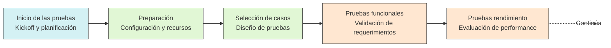
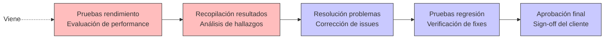
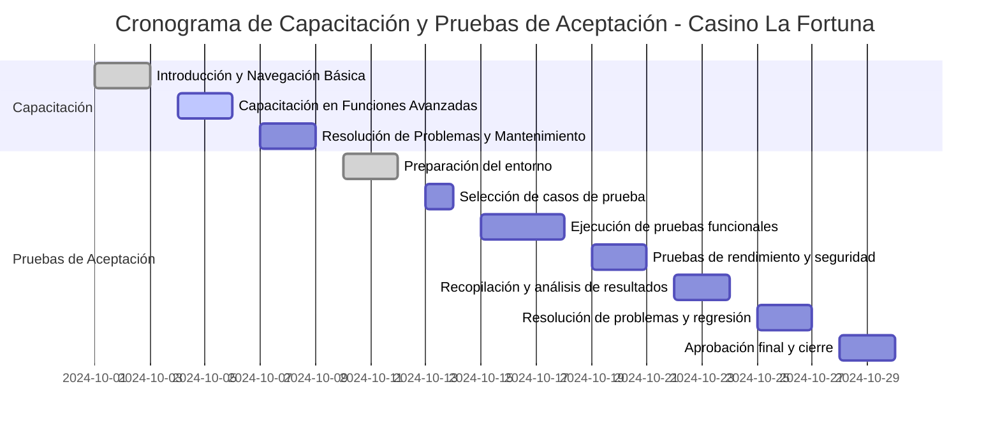

# Plan de capacitación y realización de pruebas de aceptación del cliente

## Presentado por:
**Penélope Noreña Ramos**
**Hernán Darío Pérez Higuita**
**William Pérez Muñoz**

### Instructor:
**Ing. Jhon Jairo Donato**

## Servicio Nacional de Aprendizaje - SENA
### Centro de Gestión de Mercados, Logística y Tecnologías de la Información
### Regional Distrito Capital

#### Tecnología en Análisis y Desarrollo de Software
#### Ficha: 2758315.
### 2024

---

## Prefacio

### Introducción

El plan de capacitación, la realización de pruebas de aceptación del cliente y la formalización del acta de entrega son tres pilares fundamentales en la fase de implantación del software Casino La Fortuna. Estas actividades aseguran no solo que el software cumpla con los estándares de calidad y funcionalidad requeridos, sino también que los usuarios finales puedan utilizarlo de manera eficiente y efectiva en sus operaciones diarias, culminando con una entrega formal y documentada del proyecto.

La capacitación permite que todos los actores involucrados en el uso del sistema comprendan sus funcionalidades, roles, y responsabilidades, garantizando un uso adecuado desde el primer día. Por otro lado, las pruebas de aceptación (UAT) verifican que el software cumpla con los requisitos previamente establecidos, tanto funcionales como no funcionales, asegurando que esté listo para su despliegue en un entorno productivo. Finalmente, el acta de entrega formaliza la culminación exitosa del proyecto, documentando los entregables, compromisos y recomendaciones para el desarrollo futuro del sistema.

Este documento describe de manera estructurada los procesos de capacitación, validación y entrega formal, proporcionando una guía clara para garantizar el éxito en la implantación del software.

### ¿Por qué este documento?

La documentación es una herramienta fundamental para asegurar la correcta implementación, evolución y transferencia formal de un sistema de software. En este caso, se busca proporcionar una guía detallada para cumplir con los niveles de servicio establecidos, al tiempo que se facilita la transferencia de conocimientos a los usuarios finales y al equipo técnico encargado del mantenimiento futuro, documentando formalmente la entrega y aceptación del sistema.

### Objetivo del Documento

Este documento se enfoca en los lineamientos necesarios para la **implantación exitosa del software Casino La Fortuna**, contemplando los siguientes objetivos:

1. **Capacitación Eficiente:**
   * Planificar y ejecutar capacitaciones técnicas y funcionales.
   * Garantizar que todos los usuarios comprendan y utilicen eficientemente el sistema.

2. **Validación de la Solución:**
   * Ejecutar pruebas de aceptación del cliente (UAT).
   * Verificar el cumplimiento de los requisitos funcionales y no funcionales.

3. **Documentación Integral:**
   * Proveer manuales de usuario y técnico.
   * Desarrollar procedimientos claros de respaldo y recuperación.

4. **Aseguramiento de Calidad:**
   * Medir el rendimiento del sistema frente a métricas definidas.
   * Establecer un marco de soporte técnico post-implementación.

5. **Estrategia de Mejora Continua:**
   * Facilitar futuras expansiones y actualizaciones.
   * Sentar bases para el monitoreo y mantenimiento continuo del sistema.

6. **Formalización de la Entrega:**
   * Documentar formalmente la entrega y aceptación del sistema.
   * Establecer compromisos y responsabilidades post-implementación.
   * Proporcionar recomendaciones para el desarrollo futuro del sistema.

### Alcance del Documento

El alcance del documento incluye los procesos y actividades necesarios para garantizar la implantación, el soporte y la entrega formal del software, cubriendo los siguientes aspectos:

* Capacitación de usuarios finales y técnicos.
* Realización de pruebas de aceptación.
* Procedimientos para la transición y migración de datos.
* Creación de documentación técnica y de usuario.
* Estrategias de respaldo, recuperación y soporte post-implementación.
* Formalización del acta de entrega y documentación de compromisos.

Este documento no solo busca cumplir con las expectativas inmediatas del cliente, sino también sentar las bases para un sistema escalable y sostenible, que pueda adaptarse a las necesidades futuras del casino, respaldado por una documentación formal y completa de su entrega y aceptación.

---

# Implantación del software de acuerdo con los niveles de servicio establecidos con el cliente - Casino La Fortuna

## Plan de capacitación y pruebas de aceptación

El **plan de capacitación** y la **realización de pruebas de aceptación del cliente** son elementos fundamentales para garantizar la implementación exitosa del software Casino La Fortuna. Este documento detalla los procesos necesarios para asegurar que el sistema cumpla con los requisitos establecidos y que los usuarios puedan utilizarlo eficientemente.

---

### 1. Plan de Capacitación para el Software Casino La Fortuna

El plan de capacitación está diseñado para garantizar que todos los usuarios del sistema, desde personal administrativo hasta técnico, comprendan y puedan utilizar efectivamente todas las funcionalidades del software.

#### 1.1. Objetivos de la Capacitación

- Familiarizar a los usuarios con las funcionalidades clave del sistema Casino La Fortuna.
- Instruir sobre procedimientos específicos para cada rol:
  - Gestión de máquinas tragamonedas.
  - Control de juegos online.
  - Administración de apuestas.
  - Sistema de reportería.
  - Módulo de transacciones.
- Capacitar al personal técnico en:
  - Mantenimiento preventivo.
  - Resolución de problemas comunes.
  - Procedimientos de escalamiento de incidencias.
- Asegurar el cumplimiento de protocolos de seguridad y auditoría.

---

#### 1.2. Público Objetivo y Participantes

| Grupo                       | Nombre           | Cargo                        | Sesión Programada | Modalidad        |
|-----------------------------|------------------|------------------------------|-------------------|------------------|
| **Personal Administrativo** | Javier Morales   | Gerente General              | Semana 1, Día 1   | Presencial       |
|                             | Luisa Fernández  | Administradora Financiera    | Semana 1, Día 2   | Presencial       |
| **Personal Operativo**      | Andrés Pérez     | Operador de Máquinas         | Semana 2, Día 3   | Presencial/Online|
|                             | Sandra Torres    | Crupier                      | Semana 2, Día 3   | Presencial/Online|
| **Equipo Técnico**          | Carlos Ramírez   | Administrador del Sistema    | Semana 2, Día 4   | Presencial       |
|                             | Natalia Gómez    | Personal de Mantenimiento    | Semana 2, Día 5   | Presencial       |

---

#### 1.3. Métodos de Capacitación

| Modalidad | Características | Recursos | Plan de Contingencia |
|-----------|----------------|-----------|---------------------|
| **Sesiones Presenciales** | - Duración: 4 horas - Frecuencia: 3/semana - Grupos: Máx. 10 personas | - Sala de capacitación - Material impreso - Equipos de práctica | - Sesiones grabadas - Material digital - Soporte remoto |
| **Sesiones Online** | - Plataforma: MS Teams - Duración: 2 horas - Grabación disponible | - Material multimedia - Guías digitales - Ejercicios prácticos | - Sesiones asincrónicas - Tutorías individuales |

**Documentación y Recursos**

| Tipo de Material  | Formato | Accesibilidad      | Actualización   |
|-------------------|---------|--------------------|-----------------|
| Manual de usuario | PDF/Web | Descargable/Online | Mensual         |
| Guías rápidas     | PDF     | Descargable        | Según necesidad |
| Videos tutoriales | MP4     | Streaming/Descarga | Trimestral      |
| FAQs              | Web     | Online             | Semanal         |

---

#### 1.4. Agenda de Capacitación

| Semana | Día | Actividad | Descripción | Material Requerido |
|--------|-----|-----------|-------------|--------------------|
| 1 | 1 | Introducción al Sistema | - Visión general - Navegación básica - Gestión de perfiles - Configuraciones iniciales | - Manual básico - Accesos de prueba |
| 1 | 2 | Módulos Principales | - Gestión de usuarios - Control de accesos - Panel de administración - Dashboards principales | - Guías de módulos - Ejercicios prácticos |
| 1 | 3 | Operaciones Básicas | - Registro de transacciones - Gestión de máquinas - Monitoreo en tiempo real - Reportes básicos | - Manual operativo - Casos de estudio |
| 2 | 4 | Gestión Financiera | - Procesamiento de transacciones - Conciliaciones - Cierre de caja - Reportes financieros | - Manual financiero - Plantillas |
| 2 | 5 | Administración del Sistema | - Configuraciones avanzadas - Gestión de backups - Monitoreo - Resolución de problemas | - Manual técnico - Herramientas diagnóstico |
| 2 | 6 | Seguridad y Auditoría | - Políticas de seguridad - Logs y auditoría - Protocolos de emergencia - Recuperación de datos | - Guías de seguridad - Protocolos |

---

#### 1.5. Evaluación de la Capacitación

| Tipo de Evaluación    | Frecuencia   | Criterios de Éxito          | Seguimiento         |
|-----------------------|--------------|-----------------------------|---------------------|
| Pruebas prácticas     | Diaria       | ≥ 80% de tareas completadas | Registro individual |
| Evaluaciones teóricas | Por módulo   | ≥ 85% respuestas correctas  | Informe semanal     |
| Simulacros            | Semanal      | Resolución exitosa de casos | Retroalimentación   |
| Evaluación final      | Al completar | ≥ 90% aprobación general    | Certificación       |

---

### 2. Plan para la Realización de Pruebas de Aceptación del Cliente (UAT)

#### 2.1. Objetivos

| Nivel | Objetivos | Indicadores de Éxito |
|-------|-----------|---------------------|
| **General**    | - Validar funcionalidad completa - Verificar cumplimiento de requisitos  | - 100% funcionalidades probadas - Documentación completa |
| **Específico** | - Validar flujos críticos - Comprobar seguridad - Evaluar rendimiento | - Flujos críticos validados - Pruebas de seguridad exitosas |

#### 2.2. Fases de las Pruebas de Aceptación

#### 2.3. Criterios de Aceptación Detallados

| Categoría           | Métrica | Objetivo | Requisito Mínimo | Medición |
|---------------------|---------|-----------|-----------------|-----------|
| **Funcionalidad**   | Casos de prueba críticos | 100% exitosos | 98% | Por módulo |
| | Casos de prueba totales | ≥ 95% exitosos | 90% | Global |
| | Defectos críticos | Ninguno | Máx. 1 pendiente | Por sprint |
| | Defectos menores  | Máximo 5 | Máx. 8 pendientes | Total |
| **Rendimiento**     | Tiempo de respuesta | ≤ 2 segundos | ≤ 3 segundos | Por operación |
| | Usuarios concurrentes | ≥ 500 | ≥ 400 | Pico máximo |
| | Disponibilidad    | ≥ 99.9% | ≥ 99.5% | Mensual |
| | Transacciones     | ≤ 1 segundo | ≤ 1.5 segundos | Por operación |
| **Seguridad**       | Autenticación | Implementada | Validada | Por rol |
| | Encriptación      | AES-256 | Implementada | Por dato sensible |
| | Control de acceso | 100% roles | Validado | Por permiso |
| | Auditoría         | Logs completos | Implementado | Por acción |

---

**Cronograma Detallado**

---

#### 2.5. Fases de Implementación Detalladas

| Fase                  | Actividades Principales | Entregables | Responsables | Duración  |
|-----------------------|-------------------------|-------------|--------------|-----------|
| **2.5.1 Preparación** | - Revisión de requisitos - Configuración de entornos - Definición de casos | - Plan de pruebas - Ambiente configurado - Casos documentados      | Equipo técnico | 3 días |
| **2.5.2 Ejecución**   | - Pruebas funcionales - Pruebas de carga - Validación de seguridad | - Registros de pruebas - Informes de rendimiento - Análisis de seguridad   | QA Team | 6 días |
| **2.5.3 Evaluación**  | - Análisis de resultados - Documentación de hallazgos - Recomendaciones | - Informe de resultados - Lista de mejoras - Plan de acción          | Coordinadores | 2 días |
| **2.5.4 Resolución**  | - Corrección de issues - Pruebas de regresión - Validación final | - Registro de cambios - Informe de regresión - Aprobación técnica      | Desarrollo | 2 días |

---

#### 2.6 Criterios de Aceptación

| Categoría               | Métrica                            | **Objetivo**                | Estado   |
|-------------------------|------------------------------------|-----------------------------|----------|
| **2.6.1 Funcionalidad** | **Casos de prueba críticos**       | **100% exitosos**           | ✔ Cumplido |
|                         | Casos de prueba totales            | ≥ 95% exitosos              | ⚠️ Pendiente |
|                         | Defectos críticos                  | **Ninguno detectado**       | ✔ Cumplido |
|                         | Defectos menores                   | ≤ 5                         | ⚠️ Pendiente |
| **2.6.2 Rendimiento**   | **Tiempo de respuesta**            | **≤ 2 segundos por operación** | ✔ Cumplido |
|                         | **Usuarios concurrentes soportados** | **≥ 500**                   | ⚠️ Pendiente |
|                         | Disponibilidad                     | ≥ 99.9%                     | ⚠️ Pendiente |
| **2.6.3 Seguridad**     | **Autenticación robusta**          | **Cumplida**                | ✔ Cumplido |
|                         | **Encriptación de datos sensibles** | **Implementada**            | ✔ Cumplido |
|                         | **Registro de auditoría**          | **Configurado y operativo** | ⚠️ Pendiente |

---

### 3. Acta de Entrega del Proyecto

#### 3.1. Encabezado

| Campo             | Descripción | Referencia | Observaciones |
|-------------------|-------------|------------|---------------|
| **3.1.1 Título**  | Acta de Entrega del Proyecto Casino La Fortuna | ACT-001-CFL-2024 | Documento oficial |
| **3.1.2 Fecha**   | 30 de abril de 2024 | 2024-04-30 | Fecha de firma |
| **3.1.3 Lugar**   | Cali, Colombia | Sede principal | Oficinas centrales |
| **3.1.4 Versión** | 1.0 | Release inicial | Sujeto a control de versiones |

---

#### 3.2. Partes Involucradas

| Rol | Información de Contacto | Responsabilidades | Autorización |
|-----|------------------------|-------------------|--------------|
| **3.2.1 Cliente** | **Javier Morales** Gerente General jmorales@casino.com Tel: +57 301 234 5678 | - Aprobación final - Validación de requisitos - Autorización de cambios | Firma y sello |
| **3.2.2 Proveedor** | **William Pérez Muñoz** Coordinador del Proyecto wperez@casino-la-fortuna.com Tel: +57 315 272 8882 | - Entrega del sistema - Garantía técnica - Soporte post-implementación | Firma y sello |

---

#### 3.3. Descripción del Proyecto

El sistema **Casino La Fortuna** es una solución integral diseñada para la gestión de operaciones del casino, enfocada en mejorar la eficiencia administrativa y operativa, y optimizar procesos clave como:

| Aspecto | Detalle | Estado | Documentación |
|---------|----------|--------|---------------|
| **3.3.1 Alcance** | Sistema integral de gestión para Casino La Fortuna | Completado | Especificación técnica |
| **3.3.2 Módulos** | - Gestión de máquinas y juegos - Administración de apuestas - Sistema transaccional - Reportería avanzada | Implementados | Manuales técnicos |
| **3.3.3 Objetivos** | - Optimización operativa - Control financiero - Seguridad transaccional | Cumplidos | Informes de validación |

---

#### 3.4. Entregables

| Categoría | Componentes | Ubicación | Documentación Asociada |
|-----------|-------------|----------|----------------------|
| **3.4.1 Código Fuente** | - Frontend (React/TypeScript) - Backend (Node.js) - Scripts de BD | GitHub Enterprise | - README.md - Guías de instalación - Scripts de despliegue |
| **3.4.2 Documentación** | - Manual técnico - Manual de usuario - Guías de operación | Repositorio docs | - Diagramas arquitectura - Flujos de proceso - Configuraciones |
| **3.4.3 Repositorios** | - Código principal - Documentación - Assets | GitHub | - Permisos de acceso - Políticas de branches - CI/CD |

---

#### 3.5. Criterios de Aceptación

| Requisito          | Resultado Esperado | Estado | Evidencia |
|--------------------|-------------------|--------|-----------|
| **3.5.1 Acceso**   | - Autenticación segura - Roles diferenciados - SSO implementado | ✓ Cumplido | Pruebas UAT |
| **3.5.2 Gestión**  | - CRUD usuarios - Perfiles configurables - Auditoría completa | ✓ Cumplido | Logs sistema |
| **3.5.3 Reportes** | - Generación < 5s - Exportación múltiple - Filtros avanzados | ✓ Cumplido | Tests rendimiento |

---

#### 3.6. Observaciones y Recomendaciones

| Aspecto | Estado Actual | Limitación | Plan de Mejora |
|---------|---------------|------------|----------------|
| **3.6.1 Infraestructura** | Operativa | Máx. 1,000 usuarios | Escalamiento Q3 2024 |
| **3.6.2 Funcionalidades** | Completas | Reportes personalizados | Desarrollo Q2 2024 |
| **3.6.3 Integración** | Parcial | APIs terceros | Roadmap 2024 |

---

#### 3.7. Sugerencias para Futuras Expansiones

| Área                | Mejora Propuesta        | Prioridad | Timeline |
|---------------------|-------------------------|-----------|----------|
| **Pagos**           | Integración PayU/Stripe | Alta      | Q2 2024  |
| **Analytics**       | IA para tendencias      | Media     | Q3 2024  |
| **Mobile**          | App responsiva          | Alta      | Q2 2024  |

---

##### 3.7.1 Integración de Sistemas de Pago

##### Descripción
Implementar integración con plataformas de pago como PayU o Stripe para permitir transacciones seguras y rápidas en el sistema.

###### Beneficios
- Facilitar pagos en línea para los usuarios.
- Incrementar la eficiencia en la gestión financiera.
- Proveer múltiples opciones de pago.

###### Requisitos Técnicos
- API de integración con PayU/Stripe.
- Implementación de encriptación AES-256 para datos sensibles.
- Configuración de notificaciones en tiempo real.

###### Prioridad
**Alta**

###### Timeline
**Q2 2024**

###### Indicadores de Éxito
| Métrica                  | Objetivo                     | Plazo        |
|--------------------------|------------------------------|--------------|
| **Implementación API**       | Completada                  | Q2 2024      |
| **Tiempo de respuesta**      | ≤ 2 segundos                | En producción |
| **Satisfacción del cliente** | ≥ 90%                       | Primer mes   |

---

##### 3.7.2 Incorporación de IA para Análisis Predictivo

###### Descripción
Integrar inteligencia artificial para analizar tendencias de juego y comportamiento de usuarios, proporcionando datos útiles para la toma de decisiones estratégicas.

###### Beneficios
- Identificación de patrones de uso.
- Predicción de tendencias futuras en apuestas.
- Mejora de la experiencia del usuario basada en datos.

###### Requisitos Técnicos
- Framework de IA (TensorFlow, PyTorch).
- Capacidad de procesamiento en tiempo real.
- Integración con bases de datos transaccionales.

###### Prioridad
**Media**

###### Timeline
**Q3 2024**

###### Indicadores de Éxito
| Métrica                     | Objetivo                     | Plazo        |
|-----------------------------|------------------------------|--------------|
| **Generación de informes**      | En tiempo real               | Implementación |
| **Reducción de tiempos de análisis** | ≥ 30% respecto al sistema actual | Primer mes   |
| **Toma de decisiones estratégicas** | Datos precisos al 95%      | Primer trimestre |

---

##### 3.7.3 Desarrollo de Aplicación Móvil

###### Descripción
Diseñar una aplicación móvil responsiva que permita a los usuarios acceder a todas las funcionalidades del sistema desde dispositivos móviles.

###### Beneficios
- Mayor accesibilidad para los usuarios.
- Aumento del alcance del sistema.
- Mejora de la experiencia de usuario en plataformas móviles.

###### Requisitos Técnicos
- Framework mobile (React Native, Flutter).
- Diseño UI/UX adaptado a dispositivos móviles.
- Integración con APIs existentes.

###### Prioridad
**Alta**

###### Timeline
**Q2 2024**

###### Indicadores de Éxito
| Métrica                  | Objetivo                     | Plazo        |
|--------------------------|------------------------------|--------------|
| **Compatibilidad**           | Android/iOS                  | Lanzamiento  |
| **Tiempo de carga**          | ≤ 2 segundos                | En producción |
| **Satisfacción del usuario** | ≥ 90%                       | Primer mes   |

---

#### 3.8. Aprobación y Firma

| Rol           | Información                                            | Firma y Sello                         | Fecha                  |
|---------------|--------------------------------------------------------|---------------------------------------|------------------------|
| **Cliente**   | Javier Morales Gerente General Casino La Fortuna |    _________________________ |    19/11/2024 |
| **Proveedor** | William Pérez Muñoz Coordinador del Proyecto        |    _________________________ |    17/11/2024 |

---

### 4. Observaciones Finales

#### 4.1. Conclusiones

| Aspecto        | Resultado  | Impacto       |
|----------------|------------|---------------|
| Implementación | Exitosa    | Alto          |
| Capacitación   | Completada | Positivo      |
| Aceptación     | Aprobada   | Satisfactorio |

---

#### 4.2. Recomendaciones

| Área                | Recomendación                                   | Plazo Sugerido |
|---------------------|-------------------------------------------------|----------------|
| **Monitoreo**       | Establecer un período inicial de 30 días para supervisión detallada del sistema. | Inmediato      |
| **Backups**         | Configurar una verificación semanal automática con alertas para errores o inconsistencias. | Permanente     |
| **Actualizaciones** | Realizar una revisión trimestral para evaluar nuevas versiones y mejoras del sistema. | Recurrente     |
| **Integración de API** | Añadir compatibilidad con servicios adicionales como Google Analytics para informes más robustos y segmentación de usuarios. | Q3 2024       |
| **Seguridad**       | Implementar autenticación multifactor (MFA) para administradores y usuarios sensibles. | Q2 2024       |
| **Expansión Móvil** | Desarrollar una versión optimizada para dispositivos móviles con funcionalidades clave del sistema. | Q4 2024       |

*Nota: Este documento forma parte del proceso formal de entrega del Software Casino La Fortuna y debe mantenerse como referencia para futuras actualizaciones y consultas.*

---

 
 
 
 
 
 
 
 

### 5. Glosario de Términos

| Término/Acrónimo | Definición | Contexto en el Proyecto |
|-----------------|------------|------------------------|
| **UAT** (User Acceptance Testing) | Pruebas de aceptación del usuario para validar que el sistema cumple con los requisitos funcionales y técnicos. | Fase de validación final del software |
| **MFA** (Multi-Factor Authentication) | Autenticación multifactor que requiere más de un método de verificación para acceder al sistema. | Sistema de seguridad para accesos |
| **AES-256** | Estándar de encriptación avanzado que utiliza claves de 256 bits para proteger datos sensibles. | Protección de datos financieros |
| **Dashboard** | Panel de control visual que presenta métricas clave y estadísticas del sistema de forma gráfica. | Interfaz principal de monitoreo |
| **API** (Application Programming Interface) | Interfaz de programación que permite la interacción y compartición de datos entre sistemas. | Integración con sistemas externos |
| **Framework** | Conjunto de herramientas y bibliotecas que facilitan el desarrollo de software. | Base tecnológica del proyecto |
| **Logs** | Registros que documentan eventos importantes o acciones realizadas en el sistema. | Auditoría y seguimiento |
| **KPI** (Key Performance Indicator) | Indicador clave de rendimiento para medir el éxito de actividades específicas. | Métricas de evaluación |
| **Seguridad Transaccional** | Medidas para garantizar transacciones seguras, confiables y verificables. | Operaciones financieras |
| **Qx** (Quarter) | División trimestral del año para planificación y seguimiento de proyectos. - Q1: enero-marzo - Q2: abril-junio - Q3: julio-septiembre - Q4: octubre-diciembre | Cronograma de implementación |
| **CRUD** | Create, Read, Update, Delete: operaciones básicas en bases de datos y sistemas. | Gestión de datos |
| **Backend** | Componente del sistema encargado de la lógica del servidor y procesamiento de datos. | Arquitectura del sistema |
| **Frontend** | Interfaz gráfica que interactúa directamente con los usuarios finales. | Experiencia de usuario |
| **CI/CD** (Continuous Integration/Deployment) | Procesos automatizados para integrar y desplegar cambios de software. | Metodología de desarrollo |
| **TensorFlow/PyTorch** | Frameworks de inteligencia artificial para modelos de aprendizaje automático. | Análisis predictivo futuro |
| **SSO** (Single Sign-On) | Sistema que permite acceder a múltiples aplicaciones con un único inicio de sesión. | Gestión de accesos |

*Nota: Este glosario se mantendrá actualizado conforme el proyecto evolucione y se implementen nuevas funcionalidades.*

---